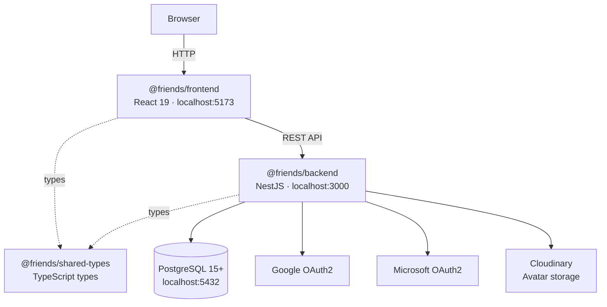

# Friends - Expense Sharing Platform

> Monorepo for managing shared expenses at events • React 19 + NestJS

A modern web application to help groups track expenses, contributions, and compensations at shared events. Built with TypeScript and organized as a pnpm monorepo with separate frontend, backend, and shared-types workspaces.

## Table of Contents

- [Live Demo](#-live-demo)
- [Workspaces](#️-workspaces)
- [Quick Start](#-quick-start)
- [Monorepo Management](#️-monorepo-management)
- [Project Structure](#-project-structure)
- [CI/CD](#-cicd)
- [Documentation](#-documentation)
- [License](#license)

---

## ✨ Live Demo

You can try the app live here: **[https://mrclit.github.io/friends-web/](https://mrclit.github.io/friends-web/)**

Features available in the demo:

- Event management and participant tracking
- Transaction types (contributions, expenses, compensations)
- Pot expenses (shared costs)
- KPI dashboard with drill-down details
- Multi-language support (Spanish, English, Catalan)
- Dark mode

---

## 🏗️ Workspaces

This is a **pnpm monorepo** containing:

| Workspace                                           | Description                        | Status         |
| --------------------------------------------------- | ---------------------------------- | -------------- |
| **[@friends/frontend](apps/frontend/)**             | React 19 + TanStack Query frontend | ✅ Operational |
| **[@friends/backend](apps/backend/)**               | NestJS + PostgreSQL API backend    | ✅ Operational |
| **[@friends/shared-types](packages/shared-types/)** | Shared TypeScript types            | ✅ Operational |

---

## 🏛️ Architecture


```mermaid
graph TD
    Browser -->|HTTP| Frontend["@friends/frontend\nReact 19 · localhost:5173"]
    Frontend -->|REST API| Backend["@friends/backend\nNestJS · localhost:3000"]
    Frontend -.->|types| Shared["@friends/shared-types\nTypeScript types"]
    Backend -.->|types| Shared
    Backend --> DB[(PostgreSQL 15+\nlocalhost:5432)]
    Backend --> Google[Google OAuth2]
    Backend --> Microsoft[Microsoft OAuth2]
    Backend --> Cloudinary[Cloudinary\nAvatar storage]
```

---

## 🚀 Quick Start

```bash
# 1. Clone the repository
git clone https://github.com/MrClit/friends-web.git
cd friends-web

# 2. Install dependencies (uses pnpm workspaces)
pnpm install

# 3. Set up environment variables
cp apps/backend/.env.example apps/backend/.env   # fill in OAuth secrets, etc.
cp apps/frontend/.env.example apps/frontend/.env # defaults work for local dev

# 4. Start PostgreSQL (backend requires Docker)
cd apps/backend && docker-compose up -d && cd ../..

# 5. Run database migrations
pnpm --filter @friends/backend migration:run

# 6. Start dev servers
pnpm dev:backend    # http://localhost:3000
pnpm dev:frontend   # http://localhost:5173
```

---

## 🗂️ Monorepo Management

### Package Manager

- **pnpm v10.30.1** with workspaces
- Configured in `pnpm-workspace.yaml`
- Lock file: `pnpm-lock.yaml`

### Working with Workspaces

```bash
# Install dependencies for all workspaces
pnpm install

# Run commands in a specific workspace
pnpm --filter @friends/frontend dev
pnpm --filter @friends/backend dev

# Run commands in all workspaces
pnpm -r build
pnpm -r test:run

# Add dependency to a specific workspace
pnpm --filter @friends/frontend add lodash
pnpm --filter @friends/backend add @nestjs/core

# Add dev dependency to root
pnpm add -D -w <package>
```

### Available Scripts

```bash
# Development
pnpm dev:frontend     # Start frontend dev server (localhost:5173)
pnpm dev:backend      # Start backend dev server (localhost:3000)

# Build
pnpm build            # Build all workspaces
pnpm build:frontend   # Build frontend only
pnpm build:backend    # Build backend only

# Testing
pnpm test             # Run all workspace tests (CI mode)
pnpm test:watch       # Run all workspace tests in watch mode
pnpm test:coverage    # Run tests with coverage

# Code Quality
pnpm lint             # Lint all workspaces
pnpm lint:fix         # Lint and auto-fix all workspaces
pnpm format           # Format with Prettier
pnpm format:check     # Check Prettier formatting

# Other
pnpm clean            # Remove all node_modules and build artifacts
```

### Git Hooks

`pnpm install` installs a **`pre-push`** hook (husky). Every `git push` runs the same command this
project requires before opening a PR:

```bash
pnpm lint && pnpm test && pnpm build
```

That is ESLint, Prettier, the workspace checks (`check:skills`, `check:env`), the frontend and
backend unit suites, and — only through `build` — type-checking, which neither `lint` nor `test`
does. It takes about **30 s** on a warm cache and writes nothing that git tracks. The backend
integration and e2e suites are not included: they need Postgres and an `apps/backend/.env.test`.

The hook is a safety net, not a substitute for running the command yourself: a failure found at push
time has already cost you a commit. And it is not optional — `--no-verify` and `HUSKY=0` are the same
bypass under two names, and neither is allowed.

Hooks are installed by the root `prepare` script (`node .husky/install.mjs`), which exits early when
`NODE_ENV=production` or `CI=true`, so production installs and CI runners never get them. They live
per working tree: a fresh clone or a new `git worktree` has no hook until `pnpm install` has run
there.

---

## 📂 Project Structure

```
friends-web/
├── apps/
│   ├── frontend/           # @friends/frontend — React 19 application
│   │   ├── src/
│   │   ├── package.json
│   │   └── README.md
│   └── backend/            # @friends/backend — NestJS API
│       ├── src/
│       ├── docker-compose.yml
│       ├── package.json
│       └── README.md
├── packages/
│   └── shared-types/       # @friends/shared-types — shared TS types
│       ├── src/
│       └── package.json
├── docs/                   # Pending designs and valid runbooks only (no shipped-work plans)
├── scripts/
│   ├── check-skills-symlinks.mjs # Skill symlink wiring check (pnpm check:skills)
│   └── check-env-files.mjs       # Backend .env exposure check (pnpm check:env)
├── .husky/
│   ├── install.mjs             # Hook installer, run by `prepare` (skips in CI and production)
│   └── pre-push                # Runs lint + test + build before every push
├── .github/
│   └── workflows/
│       ├── ci.yml              # Lint, tests and build on every PR
│       └── deploy.yml          # Auto-deploy frontend on push to main
├── package.json            # Root package (friends-monorepo)
├── pnpm-workspace.yaml     # pnpm workspaces config
└── pnpm-lock.yaml          # Lockfile
```

---

## 🔄 CI/CD

| Workflow       | Trigger                       | Description                                                                      |
| -------------- | ----------------------------- | -------------------------------------------------------------------------------- |
| **ci.yml**     | PR to `develop`/`main`        | Lint, frontend tests and build; backend unit, integration and e2e against Postgres |
| **deploy.yml** | Push to `main`                | Lints, tests, builds frontend, deploys to GitHub Pages                             |

The same full check runs locally: `pnpm lint && pnpm test && pnpm build`, before opening a PR and
again mechanically on every push through the [`pre-push` hook](#git-hooks). What the hook cannot
cover is the backend integration and e2e suites, which need a running Postgres — those are CI's
alone. Production promotion is a pull request from `develop` into `main`,
merged with a merge commit — `main` is protected and rejects direct pushes. The full sequence (version
bump, `CHANGELOG.md`, tag and GitHub Release) lives in the `release` skill, with this repo's
coordinates in [`.claude/gh-project.md`](.claude/gh-project.md).

---

## 📚 Documentation

Workspace-level READMEs:

- **[Frontend README](apps/frontend/README.md)** — React 19 + TanStack Query, architecture, state management, env vars, testing
- **[Backend README](apps/backend/README.md)** — NestJS + PostgreSQL, API endpoints, migrations, env vars, testing
- **[Shared Types README](packages/shared-types/README.md)** — shared TS types used across workspaces

Operational documentation:

- **[Deployment Guide](DEPLOYMENT.md)** — Canonical production deployment and rollback runbook
- **[Security Policy](.github/SECURITY.md)** — Secret handling, rotation policy, and incident playbook

**[docs/](docs/)** holds only living documents: designs still pending execution and runbooks still
valid. Plans for work already shipped are deleted — the code is the truth and the issue plus its PR
are the record. Architecture and conventions live in [CLAUDE.md](CLAUDE.md) and, per side of the monorepo,
in [.claude/rules/](.claude/rules/); the API contract is the Swagger UI at `/api/docs`.

---

## License

This project is licensed under the GNU General Public License v3.0. See the [LICENSE](LICENSE) file for details.
